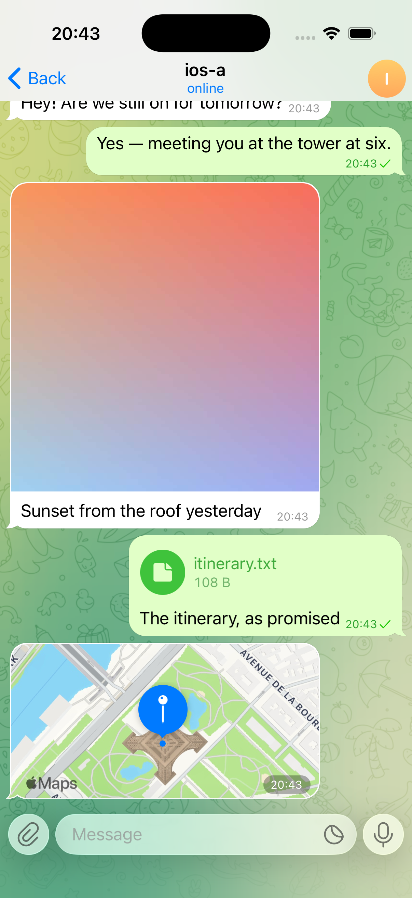
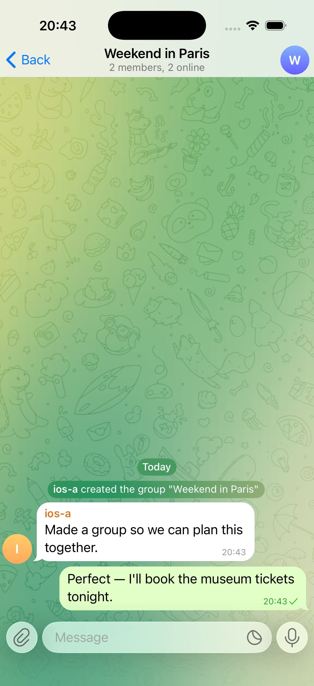
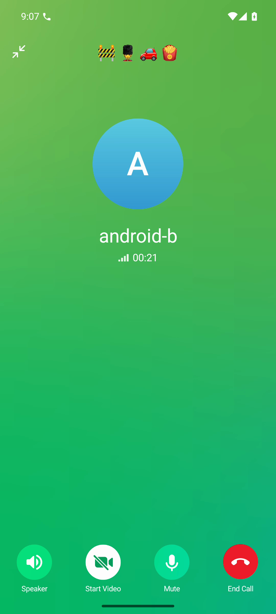
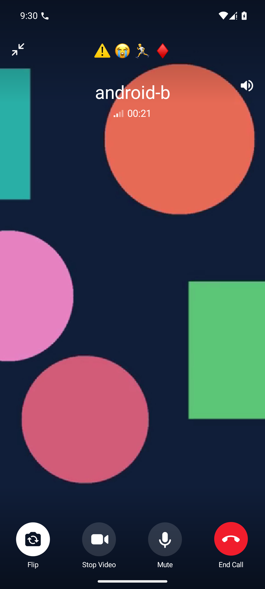
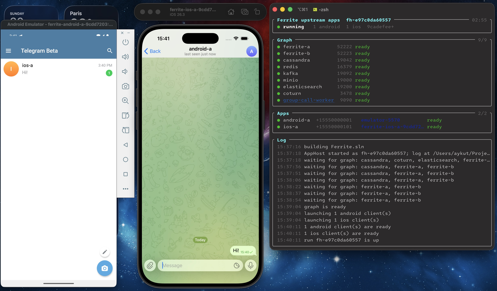

# Ferrite Telegram Server (Unofficial)

<p align="center">
  <a href="https://github.com/aykutalparslan/Ferrite/actions/workflows/build.yml"></a>
  <a href="https://github.com/aykutalparslan/Ferrite/actions/workflows/codeql-analysis.yml"></a>
  <a href="LICENSE"></a>
  <a href="https://deepwiki.com/aykutalparslan/Telegram-Server"></a>
</p>

Run real Telegram Android/iOS clients against your own open-source MTProto server.
Ferrite is a C#/.NET implementation of Telegram's server
API. It gives protocol researchers and client developers an independent MTProto
server they can run locally, inspect, and change.

<p align="center">
  
  
  
  
</p>

<p align="center">
  <sub>Telegram-iOS 12.0 and Telegram for Android 12.0.1, both at layer 214.
  Each panel is an uncropped capture from an official client connected to
  Ferrite.</sub>
</p>

Captures: [message exchange](docs/media/message.mp4),
[voice call](docs/media/voice-call.mp4), and
[video call](docs/media/video-call.mp4).

## Quick start: real clients included

Want to see what the screenshots show? Use the upstream-app launcher. It checks
out the pinned official client source, applies Ferrite's
patch, builds the app, boots an emulator or Simulator, and signs in a disposable
account for you. It also starts the complete two-node Ferrite stack.

There is one unavoidable bit of setup: these are the real apps, so you
need their build tools. Start with Git, Python 3, the .NET 10 SDK selected by
[`global.json`](global.json), and Docker running Linux containers. The launcher
downloads the pinned JDK and Bazel itself, verifies both against `PIN`, and
caches them inside the checkout, so you do not install or locate either one.

Then clone Ferrite:

```sh
git clone https://github.com/aykutalparslan/Telegram-Server.git
cd Telegram-Server
```

For two Android clients on macOS or Linux, install the pinned Android API 35
toolchain from the
[official-client guide](interop/upstream-clients/README.md), then run:

```sh
./scripts/ferrite-upstream-apps up --android 2 --ios 0
```

On a Mac, you can mix Android and iOS clients instead. That also needs Xcode
26.3 and its Metal toolchain:

```sh
./scripts/ferrite-upstream-apps up --android 1 --ios 1
```


Any supported mix works the same way — `--android 1 --ios 2` and
`--android 2 --ios 2` are the other two combinations tested. Every app
signs in on its own and ends up with every other app in the run as a contact,
across both platforms.

The first build is not small—the launcher is compiling Telegram, not a demo
shell. Later runs reuse the source and build outputs. If a toolchain, patch, or
digest is wrong, the launcher stops before creating anything. When it finishes,
each app is sitting at its normal chat list, already signed in to Ferrite, and
the terminal shows `"status": "running"`.

Check the run whenever you like:

```sh
./scripts/ferrite-upstream-apps status
```

A healthy result shows both MTProto endpoints (`52222` and `52223`), every
dependency, and every requested client as ready. Clean up with:

```sh
./scripts/ferrite-upstream-apps down
```

The launcher only removes resources recorded in its own run manifest. The
deployment uses disposable data, fixed loopback ports, and sample credentials,
so keep it on your machine.

Just want the server? Skip the client toolchains and Docker:

```sh
dotnet run --project Ferrite
```

That starts one file-backed node on port `5222`. It does not patch, build, launch,
or provision a Telegram client. See the
[installation guide](docs/installation.md) before connecting your own client or
replacing the public sample server key.

## What works today

- MTProto over TCP and WebSocket, including authorization, sessions, updates,
  profiles, contacts, and dialogs.
- One-to-one and group messaging, basic groups, channels and supergroups,
  scheduled messages, search, reactions, and moderation controls.
- Photo, document, and media upload/download, plus end-to-end encrypted secret
  chats.
- Private voice and video calls, group calls, broadcast playback, and group-call
  recording.
- Local filesystem storage for a minimal node, or a two-node development stack
  backed by Cassandra, Redis, Kafka, MinIO, and Elasticsearch.
- Reproducible official Telegram Android and iOS inputs, with every published
  capture tied to exact client and Ferrite revisions in the
  [demo guide](docs/demo.md).

Emulators do not have a real
camera, so the video call uses a generated test pattern as its camera source.
The capture clients add local provisioning and observation controls. Ferrite is independent software and is
not affiliated with, endorsed by, or connected to Telegram Messenger Inc.

## Implemented API surface

Ferrite classifies every function declared by its layer-214 schema and dispatches
*494 of 732 operations* — 490 through concrete method handlers and four through
core request-pipeline wrappers.

Coverage is complete or near-complete in the namespaces a running client depends
on: `phone`, `chatlists`, `stickers`, `langpack`, `photos`, `updates` and
`folders` are fully implemented, `channels` is 64 of 66, `contacts` 26 of 27 and
`auth` 22 of 23. The two largest namespaces are partial by size but not by
gap: `messages` 167 of 230 and `account` 95 of 120.

The `bots`, `payments`, `stories`, `premium`, `smsjobs` and `fragment` namespaces
are deliberately disabled and return `403 METHOD_DISABLED`. Coverage describes
which RPCs have a server implementation, not complete behavioral parity with
Telegram's production service.

## What's next: multi-layer support

Ferrite serves exactly layer 214 today. The next protocol milestone is one
layer-223 implementation that also serves every published API layer back to 214,
so clients on layers 214, 215, 216, 217, 218, 219, 220, 222, and 223 can share a
deployment.

## Deployment

The quick start above is a development environment, not a deployment target. For
anything else, `deploy/` holds the inputs it is built from —
`Dockerfile.ferrite` for the server image and `coturn/` for the TURN
configuration relayed calls need. See [docs/deployment.md](docs/deployment.md).

Ferrite loads `default-private.key` and `default-public.key` from its working
directory and generates a pair there when they are absent. The repository ships
a *sample* pair under `Ferrite/` so a fresh clone runs immediately, and the build
copies it into the output directory and the server image — delete both files and
rebuild before any real deployment.

## Configuration

Everything is configured through `FERRITE_*` environment variables, including the
addresses of Cassandra, Redis, Kafka, S3-compatible object storage, and
Elasticsearch, so the same image runs against your own backends. See
[docs/configuration.md](docs/configuration.md).

## Security

Report vulnerabilities privately as described in [SECURITY.md](SECURITY.md).
Please do not open a public issue for a security problem.

## Contributing and releases

Development setup, test expectations and pull-request guidance are in
[CONTRIBUTING.md](CONTRIBUTING.md). Release-level changes are summarized in
[RELEASE_NOTES.md](RELEASE_NOTES.md).

## License

Copyright (C) 2022-2026 Aykut Alparslan KOÇ

Ferrite is free software: you may redistribute it and/or modify it under the terms
of the *GNU Affero General Public License, version 3 or later*. It is distributed
WITHOUT ANY WARRANTY; without even the implied warranty of MERCHANTABILITY or
FITNESS FOR A PARTICULAR PURPOSE. See [LICENSE](LICENSE) for the full text.

`Ferrite.Transport` contains files derived from ASP.NET Core, used under the MIT
license; see [Ferrite.Transport/LICENSE.aspnetcore](Ferrite.Transport/LICENSE.aspnetcore).

## Star

If Ferrite is useful for your MTProto research, client development, or self-hosting experiments, consider starring the repository. It helps other developers discover it.
